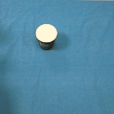
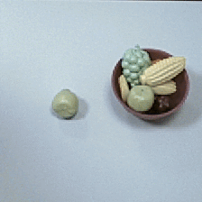
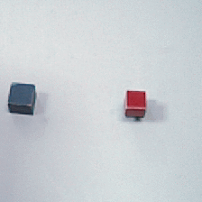
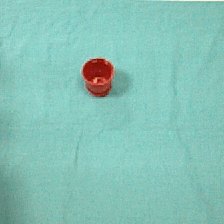
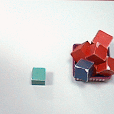
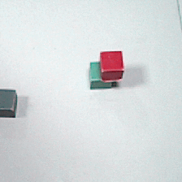
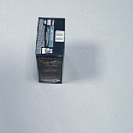

# FINO-Net

<p align="center">
  
</p>

<p align="center">
  面向机器人操作失败检测的 RGB、深度与音频多模态融合网络
</p>

FINO-Net（**F**ailure detect**I**on with multimodal se**N**sor fus**O**n）以机器人操作过程中的 RGB 图像、深度图和音频为输入，判断一次操作是成功还是失败。本仓库包含 FINO-Net 的 PyTorch 训练实现、ConvLSTM 模块、FAILURE 数据样例与标注，以及若干实验脚本。

项目基于论文 [FINO-Net: A Deep Multimodal Sensor Fusion Framework for Manipulation Failure Detection](https://arxiv.org/abs/2011.05817)，IROS 2021。

## 模型概览

- **视觉分支**：将 RGB 与深度拼接为 4 通道序列，经卷积层和三层 ConvLSTM 提取时序特征。
- **音频分支**：将音频转换为 MFCC 特征，使用 CNN 提取声音表征。
- **融合与分类**：连接视觉、音频表征，通过全连接层输出二分类结果（`0` 为成功、`1` 为失败）。
- **操作类别**：`place`、`pour`、`push`、`put_in`、`put_on`。

## 仓库结构

```text
.
├── annotation/                 # 各操作类别的标签文件
├── assets/                     # 项目图标与数据集操作示例 GIF
├── src/
│   ├── convlstm.py             # ConvLSTM 实现
│   ├── train_autodl_0.py       # 当前推荐的训练脚本
│   ├── train2.py, train3.py    # 其他训练实验版本
│   ├── test1.py                # 训练/测试实验脚本
│   └── *.ipynb                 # 交互式实验笔记
└── README.md
```

## 环境准备

建议使用 Python 3.9 或更高版本，并根据本机 CUDA 环境从 [PyTorch 官网](https://pytorch.org/get-started/locally/) 安装对应的 `torch` 与 `torchvision`。

远程训练环境可使用 Python 3.10、PyTorch 2.1.2 与 CUDA 11.8；实际版本应与所选 CUDA 驱动匹配。

```bash
python -m venv .venv

# Windows PowerShell
.\.venv\Scripts\Activate.ps1

python -m pip install --upgrade pip
python -m pip install numpy pandas pillow scikit-learn librosa scipy keras-preprocessing
# 按 PyTorch 官网给出的命令安装 torch 和 torchvision
```

主要训练脚本会用到：`numpy`、`pandas`、`Pillow`、`torch`、`torchvision`、`scikit-learn`、`librosa`、`scipy` 和 `keras-preprocessing`。

## 数据集

训练脚本期望数据按如下层级组织：

```text
failnet_dataset/
├── rgb_imgs/<action>/<sample-id>/...png
├── depth_imgs/<action>/<sample-id>/...tiff
└── audio/<action>/<sample-id>.wav
```

每个操作目录还需要 `annotation.txt`，其至少包含 `name` 与 `label` 列。仓库根目录的 `annotation/` 保存了相应标签文件；完整 FAILURE 数据集可从论文作者提供的 [下载地址](http://160.75.159.4/data/failure.zip) 获取，原始标注可从 [annotation.zip](https://github.com/ardai/fino-net/raw/main/annotation.zip) 下载。

> 数据集规模较大。若仅复现实验代码，建议单独下载数据到本地或挂载目录，而不要把完整数据集再次提交到 Git 历史中。

## 训练

1. 打开 [`src/train_autodl_0.py`](src/train_autodl_0.py)，修改 `param_dict` 中的三个路径：

   ```python
   'img_path': '/absolute/path/to/failnet_dataset/rgb_imgs/',
   'depth_path': '/absolute/path/to/failnet_dataset/depth_imgs/',
   'audio_path': '/absolute/path/to/failnet_dataset/audio/',
   ```

2. 按显存容量调整 `batch_size`、`n_epoch` 和学习率等超参数。

3. 从仓库根目录启动训练：

   ```bash
   python src/train_autodl_0.py
   ```

脚本会自动选择 CUDA（可用时）或 CPU，并在当前工作目录输出性能最佳的模型权重 `best_model.pth`。该文件已被 `.gitignore` 排除，避免误提交大型训练产物。

## 实验脚本说明

`src/` 下保留了不同阶段的实验脚本，数据读取流程和超参数并不完全一致：

- `train_autodl_0.py`：推荐的可直接修改并训练的版本。
- `train2.py`、`train3.py`、`old_train.py`：用于比较不同数据加载与网络实现的历史实验版本。
- `test1.py`：包含训练和测试流程的实验脚本。
- `finonet-rgb-d-a.ipynb`、`new-finonet-rgb-d-a.ipynb`：交互式探索记录。

使用其他脚本前，请先检查其 `param_dict` 中的数据路径、帧采样方式和批大小。

## 数据示例

| 结果 | Place | Pour | Put-In | Put-On | Push |
| --- | --- | --- | --- | --- | --- |
| 成功 |  |  |  |  |  |
| 失败 |  |  |  |  |  |

## 引用

如果本仓库或数据集对你的工作有帮助，请引用原论文：

```bibtex
@inproceedings{inceoglu2020fino,
  title={FINO-Net: A Deep Multimodal Sensor Fusion Framework for Manipulation Failure Detection},
  author={Inceoglu, Arda and Aksoy, Eren Erdal and Ak, Abdullah Cihan and Sariel, Sanem},
  booktitle={IEEE/RSJ International Conference on Intelligent Robots and Systems (IROS)},
  year={2021}
}
```

## 许可证

本项目采用 [MIT License](LICENSE)。论文、数据集及其衍生资源的使用请同时遵循原作者公布的许可与使用条款。
